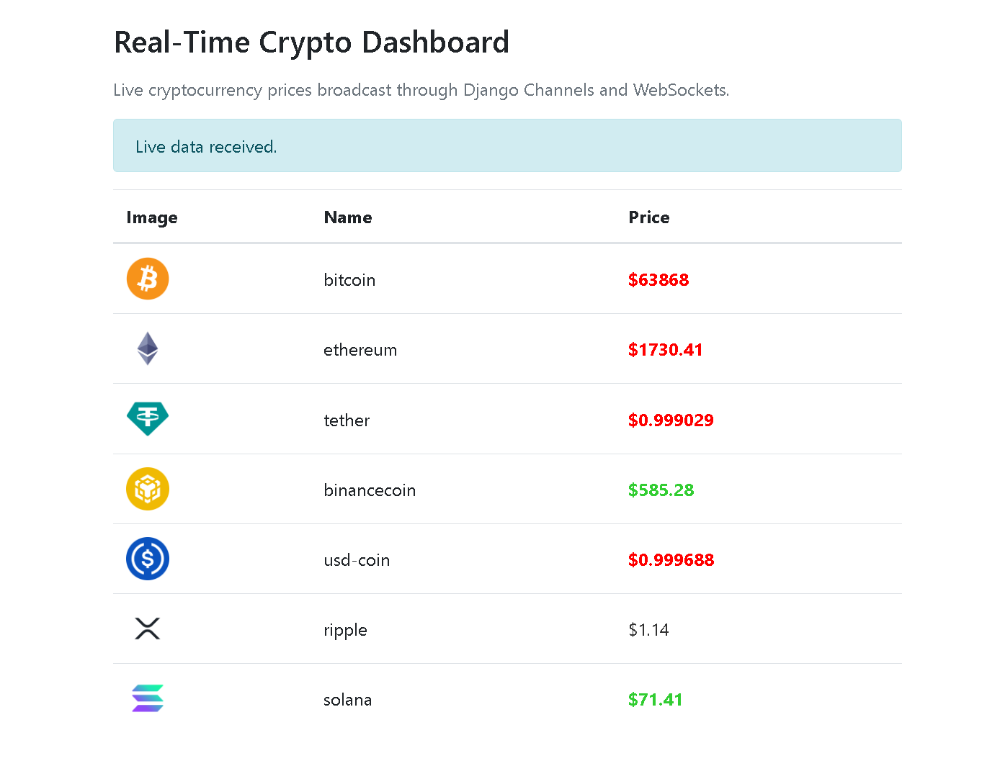

# Real-Time Crypto Dashboard

A real-time cryptocurrency dashboard built with Django, Django Channels, WebSockets, Celery Beat, Redis, and Vue.js.

The application periodically fetches cryptocurrency market data from the CoinGecko API, processes it in the background with Celery, and broadcasts live updates to connected browser clients using Django Channels and WebSockets.
## Screenshot

### Live Crypto Price Updates



## Overview

This project demonstrates a real-time data broadcasting architecture.

Instead of requiring users to manually refresh the page, the backend fetches updated cryptocurrency prices on a schedule and broadcast the new data to all connected clients automatically.

## Real-Time Flow

```text
Celery Beat
     ↓
Scheduled API Request
     ↓
Celery Worker
     ↓
CoinGecko API
     ↓
Django Channels
     ↓
WebSocket Broadcast
     ↓
Vue.js Frontend
     ↓
Live Crypto Dashboard
```

## Features

- Real-time cryptocurrency price updates
- Scheduled API polling with Celery Beat
- Background task processing with Celery
- Redis message broker
- WebSocket communication with Django Channels
- Live broadcasting to all connected clients
- Vue.js frontend rendering
- Price movement indicators
- Django backend architecture
- Docker-based Redis setup for local development

## Technologies Used

- Python
- Django
- Django Channels
- Daphne
- WebSockets
- Celery
- Celery Beat
- Redis
- Docker
- Vue.js
- JavaScript
- Bootstrap
- CoinGecko API
- SQLite

## Data Source

The project uses the CoinGecko API to fetch cryptocurrency market data.

Endpoint used:

```text
GET https://api.coingecko.com/api/v3/coins/markets
```

Example query parameters:

```text
vs_currency=usd
order=market_cap_desc
per_page=7
page=1
sparkline=false
```

The response includes cryptocurrency data such as:

- coin ID
- coin image
- current price
- market data

The backend compares the latest price with the previously saved price and marks each coin state as:

```text
raise
fall
same
```

These states are used by the frontend to visually indicate price movement.

## Architecture

```text
External Crypto API
        ↑
        │
Celery Beat triggers scheduled task
        │
        ↓
Celery Worker fetches crypto data
        │
        ↓
Redis broker coordinates background tasks
        │
        ↓
Django Channels sends data to WebSocket group
        │
        ↓
Connected clients receive live updates
        │
        ↓
Vue.js updates the dashboard UI
```

## Main Components

### Django

Django is used as the main backend framework and handles the web application structure.

### Daphne

Daphne provides ASGI support for Django Channels and allows WebSocket connections to work with the Django development server setup.

### Django Channels

Django Channels adds asynchronous support and WebSocket handling to Django.

### WebSockets

WebSockets allow the backend to push live crypto updates to the browser without a page refresh.

### Celery

Celery runs background tasks outside the normal request-response cycle.

### Celery Beat

Celery Beat schedules the periodic task that fetches cryptocurrency data from the API.

### Redis

Redis is used as the message broker for Celery and supports the real-time architecture.

### Vue.js

Vue.js is used on the frontend to update the crypto dashboard when new WebSocket data arrives.

## Project Structure

```text
real-time-crypto-dashboard/
├── coins/
├── setari/
├── static/
├── templates/
├── manage.py
├── requirements.txt
├── README.md
└── .gitignore
```

## Installation

Clone the repository:

```bash
git clone https://github.com/chrispsk/real-time-crypto-dashboard.git
cd real-time-crypto-dashboard
```

Create and activate a virtual environment:

```bash
python -m venv venv
```

On Windows:

```bash
venv\Scripts\activate
```

On macOS/Linux:

```bash
source venv/bin/activate
```

Install dependencies:

```bash
pip install -r requirements.txt
```

## Requirements

Recommended `requirements.txt`:

```text
Django==4.2.17
daphne==4.2.2
channels==4.2.0
channels-redis==4.2.1
celery==5.4.0
redis==5.2.1
requests==2.32.3
gevent==24.11.1
```

## Redis Setup

Redis must be running before starting Celery and the Django application.

### Using Docker

Create and start a Redis container:

```bash
docker run --name crypto-redis -p 6379:6379 -d redis:7
```

If the container already exists, start it with:

```bash
docker start crypto-redis
```

Check that Redis is running:

```bash
docker ps
```

You should see a container named:

```text
crypto-redis
```

with port mapping:

```text
0.0.0.0:6379->6379/tcp
```

## Database Setup

Run migrations:

```bash
python manage.py migrate
```

This will create a local SQLite database:

```text
db.sqlite3
```

## Running the Project

This project needs four running processes:

```text
1. Redis
2. Django development server
3. Celery worker
4. Celery Beat
```

### 1. Start Redis

Using Docker:

```bash
docker start crypto-redis
```

If the Redis container does not exist yet:

```bash
docker run --name crypto-redis -p 6379:6379 -d redis:7
```

### 2. Start Django

In a new terminal, activate the virtual environment and run:

```bash
python manage.py runserver
```

The project uses Django Channels and Daphne for ASGI/WebSocket support.

Open the app in your browser:

```text
http://127.0.0.1:8000/
```

At this point, the page should load and connect to the WebSocket, but live data will only appear after the Celery worker and Celery Beat are running.

### 3. Start Celery Worker

Open another terminal, activate the virtual environment, and run:

On Windows:

```bash
celery -A setari worker -l info -P gevent
```

On macOS/Linux:

```bash
celery -A setari worker -l info
```

The worker should connect to Redis and show that it is ready.

### 4. Start Celery Beat

Open another terminal, activate the virtual environment, and run:

```bash
celery -A setari beat -l info
```

Celery Beat will periodically trigger the crypto price fetching task.

## Runtime Behavior

When everything is running:

1. The browser opens the dashboard.
2. Vue.js creates a WebSocket connection.
3. Django Channels accepts the connection.
4. Celery Beat triggers the scheduled crypto task.
5. Celery Worker fetches data from CoinGecko.
6. The backend updates coin data and sends it to the WebSocket group.
7. The browser receives the update.
8. Vue.js updates the dashboard without refreshing the page.

## WebSocket Endpoint

The frontend connects to:

```text
ws://127.0.0.1:8000/ws/some_url/
```

In production over HTTPS, this should use:

```text
wss://
```

instead of:

```text
ws://
```

## Example Frontend State

When the page first loads:

```text
Connected. Waiting for live crypto data...
```

After Celery Beat and the worker send data:

```text
Live data received.
```

The dashboard then displays the latest cryptocurrency data.

## Example Coin Data

The backend sends data similar to:

```json
[
  {
    "id": "bitcoin",
    "name": "bitcoin",
    "image": "https://...",
    "price": 104500,
    "state": "raise"
  },
  {
    "id": "ethereum",
    "name": "ethereum",
    "image": "https://...",
    "price": 2500,
    "state": "fall"
  }
]
```

The frontend uses `state` to apply styling:

```text
raise → green price
fall  → red price
same  → normal price
```

## Environment Variables

For local development, the current setup can use Redis directly:

```text
redis://localhost:6379
```

For production, these values should be moved to environment variables:

```env
SECRET_KEY=your-secret-key
DEBUG=False
ALLOWED_HOSTS=your-domain.com
REDIS_URL=redis://your-redis-url
```


## Troubleshooting

### WebSocket shows 404

If the browser console or server log shows:

```text
GET /ws/some_url/ HTTP/1.1 404
```

then the app is not running through ASGI/Channels correctly.

Make sure `daphne` is installed and added to `INSTALLED_APPS`.

Example:

```python
INSTALLED_APPS = [
    "daphne",
    "django.contrib.admin",
    "django.contrib.auth",
    "django.contrib.contenttypes",
    "django.contrib.sessions",
    "django.contrib.messages",
    "django.contrib.staticfiles",
    "channels",
    "coins",
]
```

Also make sure:

```python
ASGI_APPLICATION = "setari.asgi.application"
```

### WebSocket connects but no data appears

Make sure all four processes are running:

```text
Redis
Django server
Celery worker
Celery Beat
```

If Celery Beat is not running, the scheduled task will not be sent.

If the Celery worker is not running, the scheduled task will not be executed.

### Redis connection error

Make sure the Redis Docker container is running:

```bash
docker ps
```

If it is stopped:

```bash
docker start crypto-redis
```

### CoinGecko API rate limits

CoinGecko may rate-limit frequent requests.

For production, consider:

- using an API key;
- increasing the polling interval;
- caching responses;
- handling `429 Too Many Requests`.
